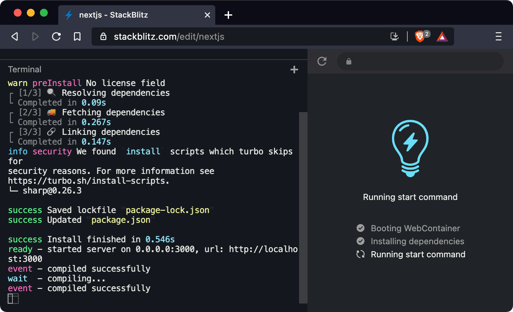
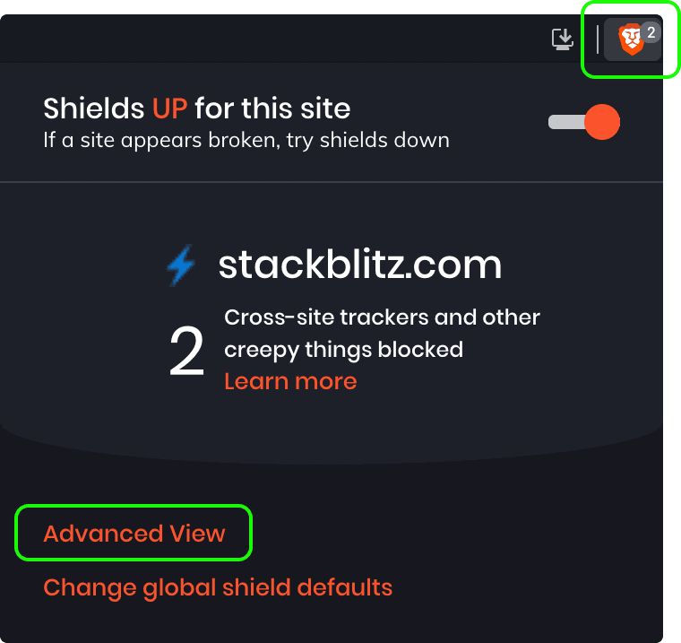
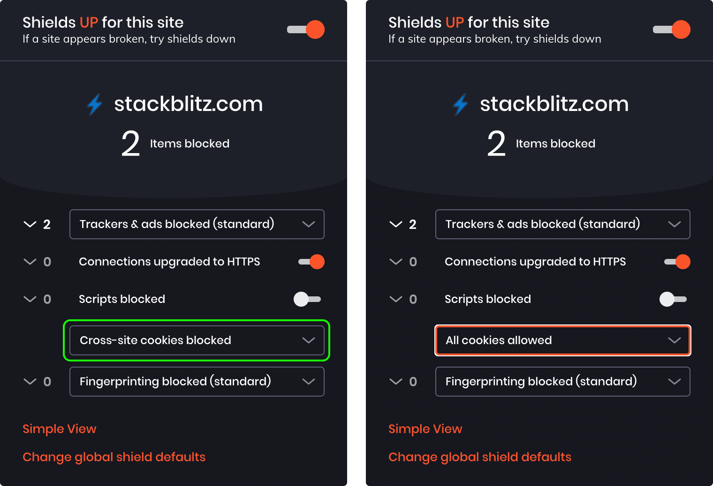
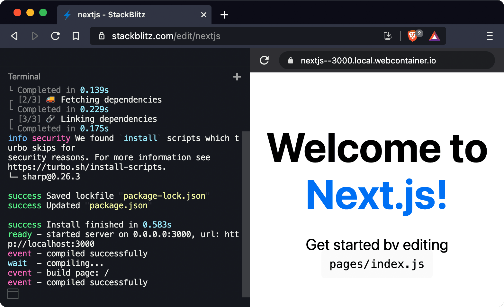

# Running WebContainer in Brave Browser

WebContainer — the technology behind Node.js projects on StackBlitz — does work in Brave. However, it requires a small configuration change.

## What’s the problem?

By default, Brave’s “Shields” feature blocks [Service Workers](https://developer.mozilla.org/en-US/docs/Web/API/Service_Worker_API) and cookies from third-party domains.

When you visit a WebContainer-enabled project on [stackblitz.com](https://www.stackblitz.com/), StackBlitz tries to register a Service Worker for the domain `<project_name>.stackblitz.io`. Since it’s considered a third-party domain, Brave will reject it.

## How to allow third-party service workers for stackblitz.com

1. Visit a WebContainer-based project, for instance https://www.stackblitz.com/edit/nextjs. The project’s boot sequence might stay stuck on the “Running start command” step:

2. Click on the “Shields” icon at the right of the address bar, then click on “Advanced View”.

3. In the advanced view, change the “Cross-site cookies blocked” option to “All cookies allowed”.

Brave will reload the page, and you should get a working project:

